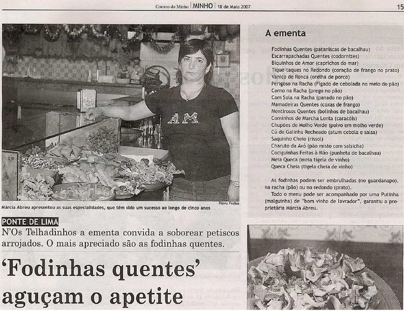
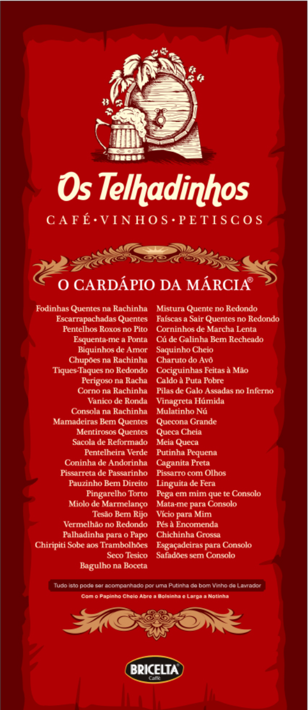
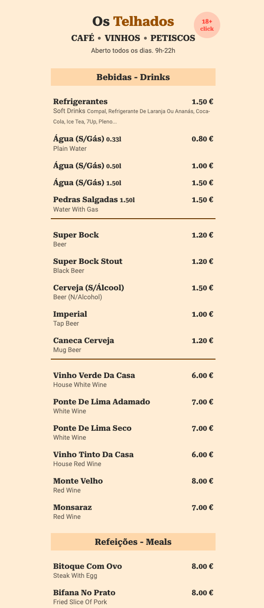
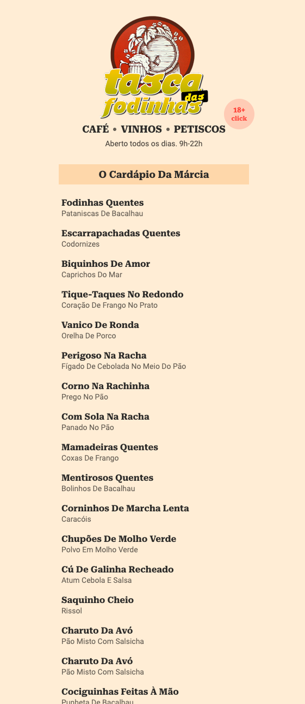

# Menu de Restaurante

## Maratona Explorer 3.0

  <a href="#descrição">Descrição</a>&nbsp;&nbsp;&nbsp;|&nbsp;&nbsp;&nbsp;
  <a href="#menu-original">Menu Original</a>&nbsp;&nbsp;&nbsp;|&nbsp;&nbsp;&nbsp;
  <a href="#resultado">Resultado</a>&nbsp;&nbsp;&nbsp;|&nbsp;&nbsp;&nbsp;
  <a href="#preview-demo">Preview Demo</a>&nbsp;&nbsp;&nbsp;|&nbsp;&nbsp;&nbsp;
  <a href="#memo-licença">Licença</a>

### Descrição

Este projeto foi desenvolvido como atividade complementar durante o evento "Maratona Explore 3.0", organizada pela [Rocketseat](https://www.rocketseat.com.br/).

Como inspiração para o projeto usei o menu do restaurante [Os Telhadinhos](http://tascadasfodinhas.com/ementa/). O restaurante "Os Telhadinhos" reflete um pouco a cultura popular do norte de Portugal.

   

### Menu Original

### Resultado

  
  

### Preview Demo

https://tasca-das-fodinhas.netlify.app/

## Licença

Esse projeto está sob a licença MIT. Veja o arquivo [LICENSE](LICENSE.md) para mais detalhes.
